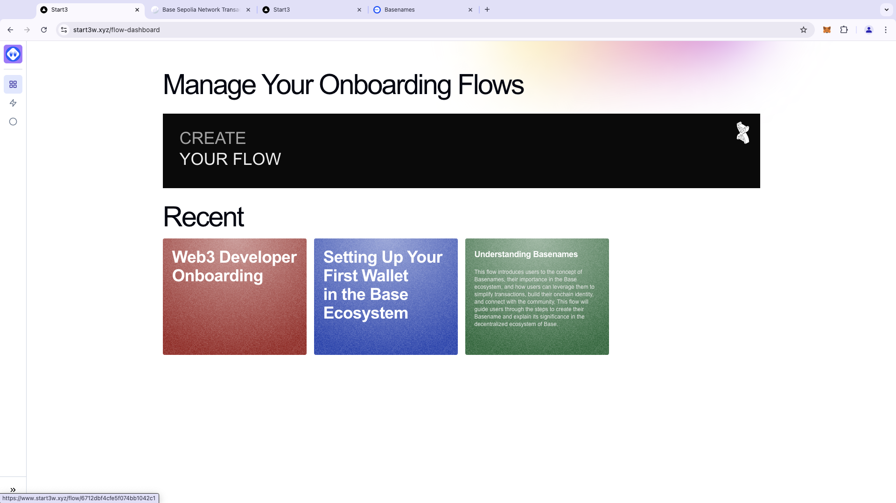

# Start3: AI-Powered Onboarding for Web3

## Overview

**Start3** is an AI-powered platform designed to simplify the onboarding process for users entering the Web3 ecosystem. From creating wallets to interacting with decentralized applications (dApps), Start3 provides a personalized, step-by-step experience that helps users build confidence in navigating the complexities of blockchain technology.

## Why This Project Is Important

The Web3 space can be daunting, especially for those unfamiliar with concepts like cryptocurrencies, decentralized finance (DeFi), and NFTs. Start3 addresses these barriers by providing users with an intuitive, user-friendly experience that demystifies Web3, encouraging broader adoption and engagement. As the world transitions toward decentralized technologies, a tool like Start3 is essential for guiding users through this shift.

## Key Features

- **AI-powered personalized onboarding flows:** Tailored onboarding experiences for each user.
- **Wallet creation guidance:** Step-by-step instructions to help users create and secure their crypto wallets.
- **dApp interaction tutorials:** Guidance on using various decentralized applications.
- **Token and NFT rewards:** Users receive rewards for completing tasks and milestones.
- **Social sharing integration:** Easy sharing of achievements and progress on social platforms.
- **Customizable onboarding campaigns:** Organizations can create tailored onboarding experiences for their communities.
- **Multi-language support:** Accessibility for users from diverse linguistic backgrounds.
- **Secure asset management:** Guidance on safely managing crypto assets.
- **Web3 tool integration:** Seamless integration with popular Web3 tools and platforms.
- **Collaboration and growth-focused:** Encouraging community-building and user growth in the Web3 space.

## Architecture

Start3 is built on a robust architecture leveraging **Next.js** for frontend development, integrated with **ethers.js** and **wagmi** for seamless blockchain interactions. The backend is designed to be scalable, with AI algorithms optimizing the onboarding process. The platform is hosted on **Vercel** for fast deployment and scalability, ensuring a smooth experience for users. Smart contracts, developed using **Solidity**, are deployed on the **Base** network, ensuring secure and efficient operations onchain.

- **Frontend:** Built using **Next.js** and styled with **Tailwind CSS**.
- **Blockchain Integration:** Powered by **ethers.js** and **wagmi** to interact with smart contracts.
- **Backend:** AI-driven algorithms optimize the onboarding process.
- **Smart Contracts:** Deployed on **Base**, enabling secure, onchain rewards and interactions.
- **Hosting:** Deployed on **Vercel** for global scalability and performance.

## Demo Video

Watch our demo to see Start3 in action:  

## Whitepaper

For more detailed information about the project, read the full whitepaper here:  
[Start3 Whitepaper](https://docs.google.com/document/d/1peqLmBk8YCYZ7z-TVZz7SmxGJUbL35ETlxqCE3Tp_2w/edit?usp=sharing)

## Slides

Check out our presentation slides for a quick overview of Start3:  
[Start3 Presentation Slides](https://docs.google.com/presentation/d/14RljRJ7QG4F2fSKX7ISRyhUV-92gQeGl5P-rS4-6YxU/edit?usp=sharing)

## Impact on the Community

Start3 is a crucial tool for democratizing access to Web3, breaking down technical barriers, and empowering communities to leverage decentralized technologies for personal and economic growth. It provides a bridge between new users and the Web3 ecosystem, creating an inclusive space where everyone can learn, build, and thrive.
